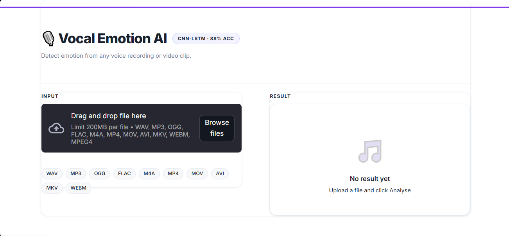
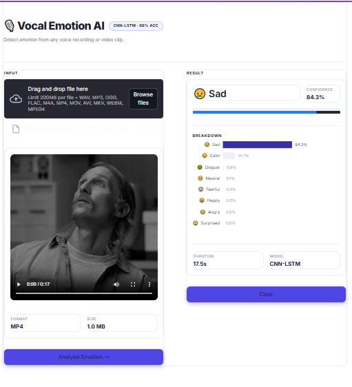
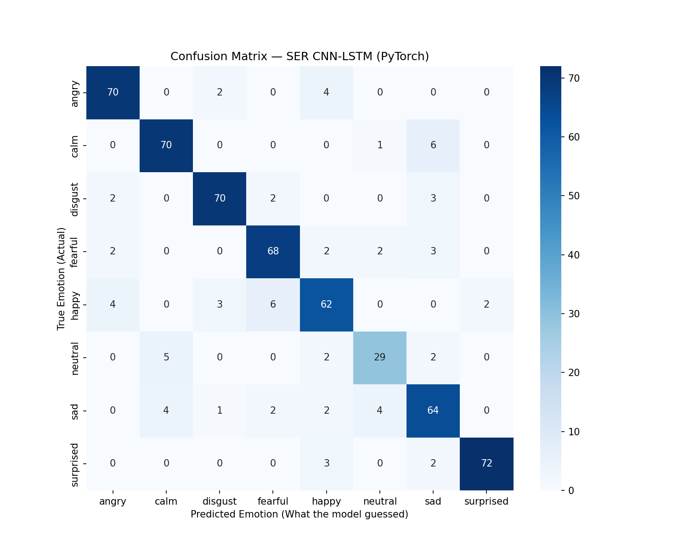

# 🎙️ Speech Emotion Recognition — Hybrid CNN-LSTM

<p align="left">
  
  
  
  
  
  
</p>

A deep learning system that classifies **8 distinct human emotions** from raw vocal audio or video input. Built with a Hybrid CNN-LSTM architecture trained on the RAVDESS dataset, deployed as a real-time web application with a FastAPI backend and Streamlit frontend.

---

## 📸 Application

**Upload Page**



**Analysis Result**



---

## 🏗️ Architecture

The model uses a **Hybrid CNN-LSTM** architecture that combines the spatial feature extraction power of Convolutional Neural Networks with the sequential modelling capability of Long Short-Term Memory networks.

```
Input: (Batch, 1, 120, 174)
  │  Raw MFCC feature map — 120 features × 174 time frames
  │
  ├─ CNN Block 1 → Conv2D(1→32) + BN + ReLU + MaxPool(2×2) + Dropout(0.25)
  ├─ CNN Block 2 → Conv2D(32→64) + BN + ReLU + MaxPool(2×2) + Dropout(0.25)
  ├─ CNN Block 3 → Conv2D(64→128) + BN + ReLU + MaxPool(2×2) + Dropout(0.30)
  │
  │  Reshape: (B, 128×15, 21) → permute → (B, 21, 1920)
  │  Treat width (21 frames) as LSTM sequence length
  │
  ├─ LSTM Layer 1 → (1920 → 128 hidden)
  ├─ LSTM Layer 2 → (128 → 64 hidden) — take last time step
  │
  ├─ FC(64 → 64) + ReLU + Dropout(0.40)
  └─ FC(64 → 8)  → raw logits → Softmax
```

**Why CNN + LSTM?**
- **CNN blocks** treat the MFCC map as a 2D image and extract local spectral and timbral patterns — analogous to detecting edges in image recognition.
- **LSTM layers** then model the temporal dynamics across the extracted feature sequence, capturing how emotion evolves through time in speech.

---

## 📊 Dataset — RAVDESS

| Property | Value |
|---|---|
| Full Name | Ryerson Audio-Visual Database of Emotional Speech and Song |
| Total Files | 2,880 WAV audio files |
| Actors | 24 (12 male, 12 female) |
| Emotions | 8 (neutral, calm, happy, sad, angry, fearful, disgust, surprised) |
| Sample Rate | 22,050 Hz |
| Split | 80% train / 10% val / 10% test |

**Emotion Label Encoding** (from RAVDESS filename convention):

| Code | Emotion | Code | Emotion |
|---|---|---|---|
| 01 | Neutral | 05 | Angry |
| 02 | Calm | 06 | Fearful |
| 03 | Happy | 07 | Disgust |
| 04 | Sad | 08 | Surprised |

---

## 🔬 Feature Engineering Pipeline

Raw audio → **MFCCs + Δ + ΔΔ** → fixed-size feature map fed into the CNN.

```python
# Parameters (must match at training and inference)
SAMPLE_RATE  = 22050   # Hz
DURATION     = 3.0     # seconds to analyse
OFFSET       = 0.5     # skip first 0.5s (silence / breath)
N_MFCC       = 40      # MFCC coefficients
MAX_PAD_LEN  = 174     # time frames (pad/truncate)
```

| Step | Output Shape | Description |
|---|---|---|
| Load audio | `(66150,)` | 3s @ 22050 Hz mono |
| `librosa.feature.mfcc` | `(40, T)` | 40 MFCC coefficients over time |
| `librosa.feature.delta` | `(40, T)` | First derivative (velocity) |
| `librosa.feature.delta(order=2)` | `(40, T)` | Second derivative (acceleration) |
| Stack vertically | `(120, T)` | Combined feature map |
| Pad / truncate | `(120, 174)` | Fixed time axis |
| Add channel dim | `(1, 120, 174)` | CNN-ready format |

The delta features capture **how** the speech characteristics change over time — critical for distinguishing emotions like *calm* vs *neutral* that share similar spectral content.

---

## 📈 Evaluation Results

**Test set: 576 samples — Overall Accuracy: 88%**

| Emotion | Precision | Recall | F1-Score | Support |
|---|---|---|---|---|
| 😠 Angry | 0.90 | 0.92 | **0.91** | 76 |
| 😌 Calm | 0.89 | 0.91 | **0.90** | 77 |
| 🤢 Disgust | 0.92 | 0.91 | **0.92** | 77 |
| 😨 Fearful | 0.87 | 0.88 | **0.88** | 77 |
| 😄 Happy | 0.83 | 0.81 | **0.82** | 77 |
| 😐 Neutral | 0.81 | 0.76 | **0.78** | 38 |
| 😢 Sad | 0.80 | 0.83 | **0.82** | 77 |
| 😲 Surprised | 0.97 | 0.94 | **0.95** | 77 |
| **Macro Avg** | **0.87** | **0.87** | **0.87** | 576 |
| **Weighted Avg** | **0.88** | **0.88** | **0.88** | 576 |

**Confusion Matrix**



**Training Details**

| Parameter | Value |
|---|---|
| Optimiser | Adam (lr = 1e-3) |
| Loss | Cross-Entropy |
| LR Scheduler | ReduceLROnPlateau (factor=0.5, patience=7) |
| Early Stopping | patience = 15 epochs |
| Epochs Run | 100 |
| Best Val Accuracy | 83.98% |
| Batch Size | 32 |
| GPU | NVIDIA Tesla T4 (Kaggle) |

---

## 🛠️ Tech Stack

| Layer | Technology |
|---|---|
| Deep Learning | PyTorch 2.3 |
| Audio Processing | Librosa 0.10 |
| Video Processing | MoviePy 1.0 |
| API Backend | FastAPI 0.111 + Uvicorn |
| Frontend | Streamlit 1.33 |
| Visualisation | Plotly |
| Training Platform | Kaggle (GPU T4) |

---

## 📁 Project Structure

```
Speech Recognition/
│
├── models/
│   ├── ser_cnn_lstm.pth        # Trained PyTorch model weights
│   └── label_encoder.pkl       # Scikit-learn LabelEncoder (8 classes)
│
├── notebooks/
│   └── cnnlstm-emotion-detection.ipynb   # Full training notebook (Kaggle)
│
├── app/
│   ├── model.py                # CNN-LSTM class definition
│   ├── predict.py              # Audio/video loading + inference pipeline
│   ├── main.py                 # FastAPI routes
│   └── run.py                  # Backend entry point
│
├── frontend/
│   └── app.py                  # Streamlit UI
│
├── viz/
│   ├── confusion_matrix.png    # Test set confusion matrix
│   ├── uploadpage.PNG          # App screenshot — upload state
│   └── results.png             # App screenshot — result state
│
├── requirements.txt
└── .gitignore
```

---

## ⚙️ Setup & Installation

### Prerequisites
- Python 3.10 or 3.11
- Git

### 1. Clone the repository

```bash
git clone https://github.com/<your-username>/speech-emotion-recognition.git
cd speech-emotion-recognition
```

### 2. Create a virtual environment

```bash
python -m venv venv

# Windows
venv\Scripts\activate

# macOS / Linux
source venv/bin/activate
```

### 3. Install dependencies

```bash
pip install -r requirements.txt
```

> **Note:** On first use, `moviepy` will download a bundled ffmpeg binary (~60 MB). This is a one-time download required for video and MP3 support.

---

## 🚀 Running the Application

You need **two terminals** with the virtual environment activated.

### Terminal 1 — Start the API backend

```bash
cd app
python run.py
```

The API will be available at `http://localhost:8000`.  
Interactive API docs: `http://localhost:8000/docs`

### Terminal 2 — Start the Streamlit frontend

```bash
cd frontend
streamlit run app.py
```

Open `http://localhost:8501` in your browser.

---

## 🌐 API Reference

### `GET /`
Health check — returns model status and supported emotion list.

**Response:**
```json
{
  "status": "running",
  "model": "CNN-LSTM (PyTorch)",
  "dataset": "RAVDESS",
  "test_accuracy": "88%",
  "emotions": ["angry", "calm", "disgust", "fearful", "happy", "neutral", "sad", "surprised"],
  "supported_formats": [".flac", ".m4a", ".m4v", ".mkv", ".mov", ".mp3", ".mp4", ".ogg", ".wav", ".webm"]
}
```

### `POST /predict`
Analyse emotion from an uploaded audio or video file.

**Request:** `multipart/form-data` with field `file`

**Supported formats:** WAV · MP3 · OGG · FLAC · M4A · MP4 · MOV · AVI · MKV · WEBM

**Response:**
```json
{
  "emotion": "happy",
  "confidence": 91.4,
  "all_scores": {
    "angry": 0.8,
    "calm": 1.2,
    "disgust": 0.3,
    "fearful": 0.5,
    "happy": 91.4,
    "neutral": 2.1,
    "sad": 1.9,
    "surprised": 1.8
  },
  "duration": 4.2,
  "window": "Middle 3s of 4.2s clip"
}
```

---

## 🔭 How Inference Works

1. **File ingestion** — Audio files loaded via `librosa`; video files have the audio track extracted via `moviepy`.
2. **Window selection** — For clips shorter than 3.5s, all audio is used. For longer clips, the middle 3 seconds are extracted (most representative of sustained emotion).
3. **Feature extraction** — 40 MFCCs + Δ + ΔΔ computed via `librosa`, padded/truncated to a `(120, 174)` feature map.
4. **Inference** — Feature map fed through the CNN-LSTM model; softmax converts logits to probabilities across 8 classes.
5. **Response** — Top emotion, confidence score, and full probability distribution returned as JSON.

---

## 📓 Training Notebook

The full training pipeline — data loading, feature extraction, model definition, training loop, and evaluation — is available in:

```
notebooks/cnnlstm-emotion-detection.ipynb
```

Originally run on **Kaggle** with a Tesla T4 GPU. Training time: approximately 4 minutes.

---

## 📄 License

This project is licensed under the MIT License.
